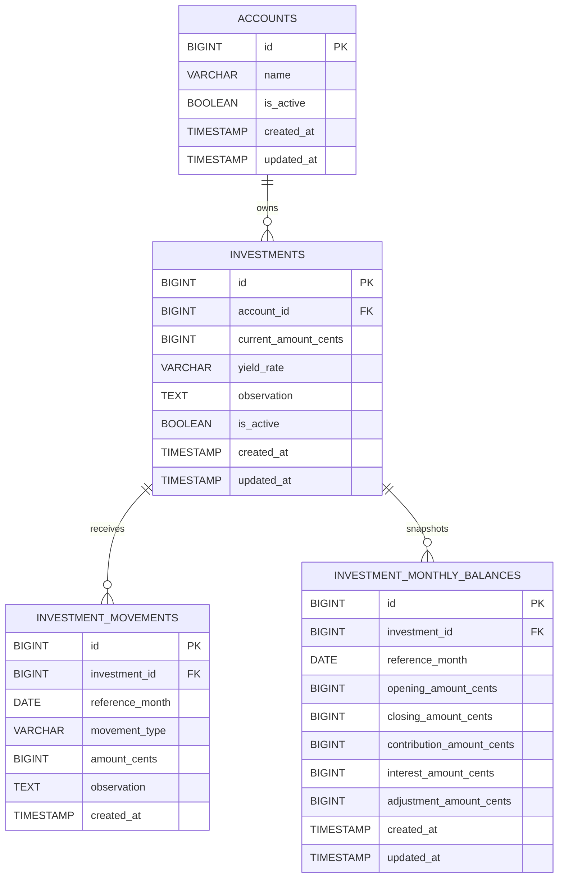

# Database Model

This first database model is based on:

- Current OpenAPI contracts for accounts, investments, and portfolio summary
- Business rules for monthly comparison and movement types
- Need to keep implementation simple, explicit, and SQL-friendly in Go

## Mermaid ER Diagram

## Notes for Implementation

- Movement types should be restricted to: INVESTMENT_CREATED, CONTRIBUTION, INTEREST, ADJUSTMENT.
- Use boolean logical delete flag with `is_active` (default true) for accounts and investments.
- Store financial amounts as integer cents to avoid floating-point precision issues.
- Use one row per investment per month in INVESTMENT_MONTHLY_BALANCES.
- Add unique constraint for monthly balance: unique(investment_id, reference_month).
- Add indexes:
  - investments(account_id)
  - investment_movements(investment_id, reference_month)
  - investment_monthly_balances(reference_month)
  - investment_monthly_balances(investment_id, reference_month)

## Why This Model

- Keeps CRUD straightforward for accounts and investments.
- Preserves event history in INVESTMENT_MOVEMENTS.
- Makes dashboard queries simple and fast with monthly snapshots.
- Supports the business rule that interest must be separated from contribution and adjustment.

## Dashboard Derivation (Portfolio Summary)

For a reference month:

- totalInvestedAmount: sum(closing_amount)
- totalMonthlyYieldAmount: sum(interest_amount)
- totalMonthlyContributions: sum(contribution_amount)
- previousMonthTotalAmount: sum(opening_amount)
- portfolioGrowthAmount: sum(closing_amount - opening_amount)
- averageMonthlyYieldRate: average by investment for the month

All amount fields above are represented in cents.
